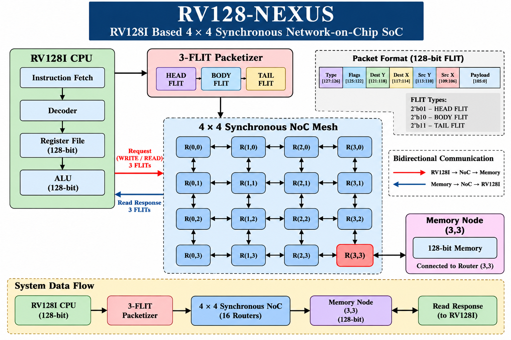

# RV128-NEXUS

## A 128-bit RV128I RISC-V Based 4×4 Synchronous Network-on-Chip SoC

RV128-NEXUS is a 128-bit RV128I RISC-V based SoC integrating a 4×4 synchronous Network-on-Chip (NoC) with a 128-bit memory node.

The project covers RTL design, functional verification, synthesis, physical implementation, timing verification, DRC, LVS, antenna checks, and final GDSII generation using the SKY130 technology flow.

> Note: Some legacy RTL/module names contain `ANoC`; the implemented architecture is synchronous and clocked.

---

## Architecture

System data flow:

RV128I CPU → 3-FLIT Packetizer → 4×4 Synchronous NoC → Memory Node (3,3) → 128-bit Memory

Bidirectional communication is supported for memory READ and WRITE transactions.

---

## Key Features

- 128-bit RV128I processor datapath
- 4×4 synchronous mesh NoC
- 16 routers
- 3-FLIT packetization
- 128-bit memory interface
- Destination-addressed routing
- Bidirectional READ/WRITE communication
- RTL functional verification
- Gate-level verification
- SKY130 ASIC implementation
- LibreLane / OpenROAD physical design
- Static timing analysis
- DRC, LVS and antenna verification
- Final GDSII generation

---

## RV128I Processor

The processor contains:

- ALU
- Decoder
- Program Counter
- Instruction Fetch
- Register File
- Core
- CPU
- NoC Interface
- NoC Packetizer

### CPU Verification

ADD PASS
SUB PASS
AND PASS
OR PASS
XOR PASS

**RV128I DATAPATH TEST PASS**

CPU execution:

- x1 = 10
- x2 = 5
- x3 = 15

**RV128I CPU TEST PASS**

---

## 4×4 Synchronous NoC

The NoC contains 16 routers arranged as a 4×4 mesh.

Memory destination:

**(3,3)**

The implemented architecture is synchronous and uses clocked routers.

---

## Packet Format

Each FLIT is 128 bits.

| Bits | Field |
|---|---|
| [127:126] | Type |
| [125:122] | Flags |
| [121:118] | Destination Y |
| [117:114] | Destination X |
| [113:110] | Source Y |
| [109:106] | Source X |
| [105:0] | Payload |

FLIT types:

- HEAD = 2'b01
- BODY = 2'b10
- TAIL = 2'b11

The packetizer uses a 3-FLIT packet.

---

## Verification

Verification was performed progressively from individual RV128I blocks through complete NoC communication.

Verification hierarchy:

ALU → Decoder → PC → Fetch → CPU → NoC Interface → Packetizer → RV128I/NoC/Memory → Bidirectional READ/WRITE → Gate-Level Verification

### Decoder Verification

ADD DECODE PASS
SUB DECODE PASS
LOAD DECODE PASS
STORE DECODE PASS
BRANCH DECODE PASS
JAL DECODE PASS

**RV128I DECODER TEST PASS**

### PC Verification

PC +4 PASS
PC +4 SECOND PASS
BRANCH TARGET PASS

**RV128I PC TEST PASS**

### Fetch Verification

PC PASS
ADDRESS PASS
INSTRUCTION PASS

**RV128I FETCH TEST PASS**

### NoC Interface Verification

WRITE REQUEST FLIT PASS
READ REQUEST FLIT PASS
READ RESPONSE PASS

**RV128I NoC INTERFACE TEST PASS**

### End-to-End Verification

Destination: (3,3)

Write address: 00000000000000000000000000000100

Write data: AAAABBBBCCCCDDDDEEEEFFFF12345678

**MESH ROUTING PASS**

**MEMORY WRITE PASS**

**RV128I ANOC END-TO-END TEST PASS**

### Bidirectional READ/WRITE Verification

DESTINATION: (3,3)
WRITE: PASS
READ: PASS
DATA MATCH: PASS

**RV128I ANOC BIDIRECTIONAL TEST PASS**

Test data:

DEADBEEF12345678AAAABBBBCAFE4321

The same 128-bit value was written to remote memory and successfully returned during the read transaction.

---

## Gate-Level Verification

**RV128I + ANoC GATE-LEVEL TEST**

**GATE-LEVEL HALT PASS**

**RV128I + ANoC GATE-LEVEL TEST PASS**

---

## Waveform Evidence

The repository contains waveform evidence for:

1. RV128I CPU execution
2. RV128I → NoC → Memory WRITE
3. Bidirectional READ/WRITE communication

Waveform files:

- `results/riscv/rv128i_cpu_wave.vcd`
- `results/riscv/rv128i_anoc_end_to_end_wave.vcd`
- `results/riscv/rv128i_anoc_read_wave.vcd`

The bidirectional READ/WRITE waveform is the primary system-level waveform.

---

## RTL-to-GDSII Flow

RTL Design → RTL Simulation → Yosys Synthesis → Floorplanning → Placement → Clock Tree Synthesis → Routing → Extraction → Static Timing Analysis → DRC → LVS → Antenna Check → GDSII

---

## Synthesis Results

Top-level design:

`rv128i_anoc_soc_top`

Final synthesis statistics:

- Wires: 4697
- Wire bits: 138350
- Cells: 4225

---

## Physical Design Results

Technology: **SKY130**

Target clock:

- Period: 5 ns
- Frequency: 200 MHz

| Metric | Result |
|---|---:|
| Core area | 738.208 µm² |
| Die area | 1889.71 µm² |
| Total instances | 105 |
| Standard-cell instances | 50 |
| Setup WNS | 0 |
| Setup TNS | 0 |
| Hold WNS | 0 |
| Hold TNS | 0 |
| Setup violations | 0 |
| Hold violations | 0 |
| Design violations | 0 |
| Antenna violations | 0 |

### Physical Verification

- DRC: **PASS**
- LVS: **PASS**
- Antenna: **PASS**

The final manufacturability checks completed successfully.

---

## Final GDSII

Final physical-design artifacts:

- `artifacts/final_gds/rv128i_anoc_soc_top.gds`
- `artifacts/final_gds/rv128i_anoc_soc_top.png`
- `artifacts/final_gds/metrics.csv`

The GDSII is the SKY130 physical implementation of the RV128-NEXUS top-level SoC.

---

## Tools and Technology

### HDL and Simulation

- SystemVerilog
- Icarus Verilog
- GTKWave

### Synthesis

- Yosys

### Physical Design

- LibreLane
- OpenROAD
- Magic
- KLayout

### Technology

- SKY130
- sky130_fd_sc_hd

---

## Repository Structure

RV128I_ANoC/

- `rtl/`
  - `riscv/`
  - `noc/`
  - `router/`
- `tb/`
  - `riscv/`
- `results/`
  - `riscv/`
  - `synthesis/`
- `artifacts/final_gds/`
- `docs/`
- `flow/`
- `librelane/`
- `env.sh.example`
- `.gitignore`
- `README.md`

---

## How to Run

From the repository root:

`cd RV128I_ANoC`

Open CPU waveform:

`gtkwave results/riscv/rv128i_cpu_wave.vcd`

Open NoC WRITE waveform:

`gtkwave results/riscv/rv128i_anoc_end_to_end_wave.vcd`

Open bidirectional READ/WRITE waveform:

`gtkwave results/riscv/rv128i_anoc_read_wave.vcd`

RTL source and testbench files are available under `rtl/` and `tb/`.

---

## Project Status

| Stage | Status |
|---|---|
| RTL Design | ✅ |
| Functional Verification | ✅ |
| NoC Verification | ✅ |
| Gate-Level Verification | ✅ |
| Synthesis | ✅ |
| Physical Design | ✅ |
| Timing Checks | ✅ |
| DRC | ✅ |
| LVS | ✅ |
| Antenna | ✅ |
| GDSII | ✅ |

---

## Future Improvements

- Larger NoC configurations
- Expanded RV128I instruction coverage
- Cache integration
- Interrupt support
- Performance benchmarking
- Router and buffer optimization
- Power optimization
- Higher-frequency timing closure

---

## Author

**Nani Naidu**

RV128-NEXUS is an ASIC/VLSI project covering RTL design, verification, synthesis, physical implementation, and final GDSII generation.
